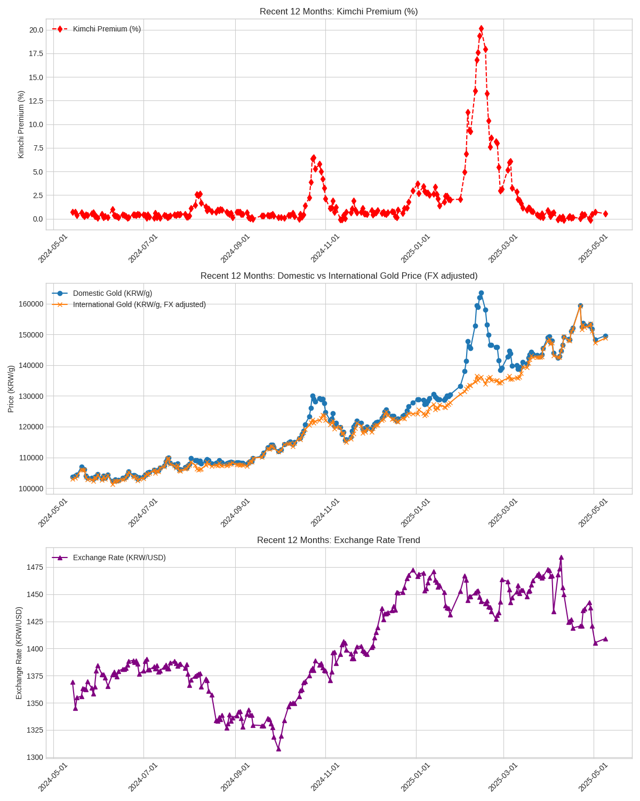

# KRX 금 가격 김치 프리미엄 분석 및 자동 실행 설정




KRX 금 가격의 김치 프리미엄을 계산하는 스크립트와 리눅스 서버에서 해당 스크립트를 매일 자동으로 실행하기 위한 방법을 설명합니다.

**스크립트:**

* now_price.py: KRX 금 가격의 김치 프리미엄을 계산합니다.
* plot.py:최근 12개월간의 김치 프리미엄 추이를 보여주는 그래프 (`kimchi_gold_price_recent_12months.png`)를 생성합니다.

**리눅스 서버 자동 실행 설정 (Cron):**

크론은 리눅스/유닉스 기반 시스템에서 특정 시간에 작업을 자동으로 실행하는 스케줄러입니다.

### 크론탭 편집

터미널에서 다음 명령어를 사용하여 크론탭을 편집합니다.

```text
crontab -e
```

### 매일 오전 10시 자동 실행 설정 (한국 시간 기준)

매일 오전 10시 (KST, UTC+9)에 스크립트를 실행하려면 크론탭에 다음 줄을 추가합니다.

```text
0 1 * * * /usr/bin/python3 /path/to/collect_price.py
```

**설명:**

* `0`: 분 (0분)
* `1`: 시 (UTC 기준 1시, 한국 시간 오전 10시)
* `*`: 일 (매일)
* `*`: 월 (매월)
* `*`: 요일 (매주 모든 요일)
* `/usr/bin/python3`: Python 3 인터프리터의 경로 (`which python3` 명령어로 확인 가능)
* `/path/to/collect_price.py`: 실제 스크립트 파일의 경로로 수정해야 합니다.

**참고사항:**

* 실행 결과는 `gold_price_log.csv` 파일에 날짜별로 누적 저장됩니다.
* 크론탭 로그 설정은 필요에 따라 별도로 구성할 수 있습니다.
* 스크립트 실행 중 오류가 발생하면 메시지가 출력됩니다.

### 크론(Cron) 상세 설명

크론 표현식은 5개의 필드로 구성되어 있으며, 각 필드는 실행 시간을 정의합니다.

**크론 표현식 형식:**

```
분 시 일 월 요일
```

**각 필드별 허용 값:**

| 필드 | 범위      | 설명                                                                  |
|------|-----------|-----------------------------------------------------------------------|
| 분   | 0-59      | 매 시의 분                                                            |
| 시   | 0-23      | 매일의 시 (0-23)                                                      |
| 일   | 1-31      | 매월의 일 (1-31)                                                      |
| 월   | 1-12, JAN-DEC | 매년의 월 (1-12 또는 영문 약자)                                         |
| 요일 | 0-6, SUN-SAT | 매주의 요일 (0-6, 0 또는 7은 일요일)                                     |

**자주 사용되는 특수 문자:**

* `*`: 해당 필드의 모든 값
* `,`: 여러 특정 값 (예: `9,17`)
* `-`: 값의 범위 (예: `1-15`)
* `/`: 값의 간격 (예: `*/5`)
* `?`: 특정 필드에서 "Any" 값 (주로 일/요일 필드에서 상호 배타적 설정)
* `L`: 일 필드 (월의 마지막 날), 요일 필드 (토요일)
* `W`: 일 필드 (가장 가까운 평일)
* `#`: 월의 몇 번째 특정 요일 (예: `3#2` - 두 번째 수요일)

**크론 표현식 예시:**

* `* * * * *`: 매분 실행
* `0 * * * *`: 매시 정각 실행
* `0 9 * * *`: 매일 오전 9시 실행
* `0 9 * * 1`: 매주 월요일 오전 9시 실행
* `0 0 1 * *`: 매달 1일 자정 실행
* `0 10 * * 1-5`: 매주 월-금요일 오전 10시 실행
* `*/10 * * * *`: 10분마다 실행

### GitHub Actions에서의 Cron 설정

GitHub Actions 워크플로우 파일 (`.github/workflows/*.yml`)에서도 `on.schedule`을 사용하여 크론 스케줄을 설정할 수 있습니다.

```yaml
on:
  schedule:
    - cron: '0 1 * * *' # 매일 오전 10시 (UTC 기준)
```

**주의:** GitHub Actions의 크론 스케줄은 **UTC 기준**으로 실행되므로, 한국 시간으로 설정 시 UTC 시간으로 변환해야 합니다. 한국 시간 오전 10시는 UTC 오전 1시에 해당합니다.

**참고 자료:**

* [https://blog.stephenturner.us/p/uv-part-2-building-and-publishing-packages](https://blog.stephenturner.us/p/uv-part-2-building-and-publishing-packages)
* [https://ecos.bok.or.kr/api/#/DevGuide/StatisticalCodeSearch](https://ecos.bok.or.kr/api/#/DevGuide/StatisticalCodeSearch)
* [https://docs.outcode.biz/tutorials/api/gold](https://docs.outcode.biz/tutorials/api/gold)
* [http://data.krx.co.kr/contents/MDC/MDI/mdiLoader/index.cmd?menuId=MDC0201060201](http://data.krx.co.kr/contents/MDC/MDI/mdiLoader/index.cmd?menuId=MDC0201060201)
